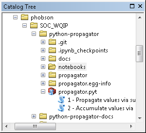
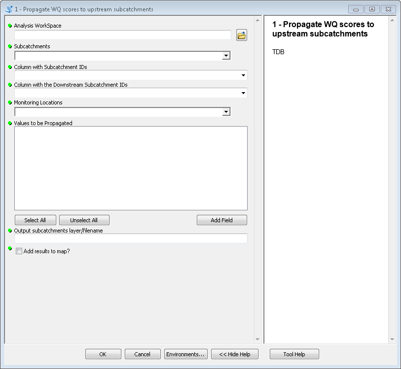
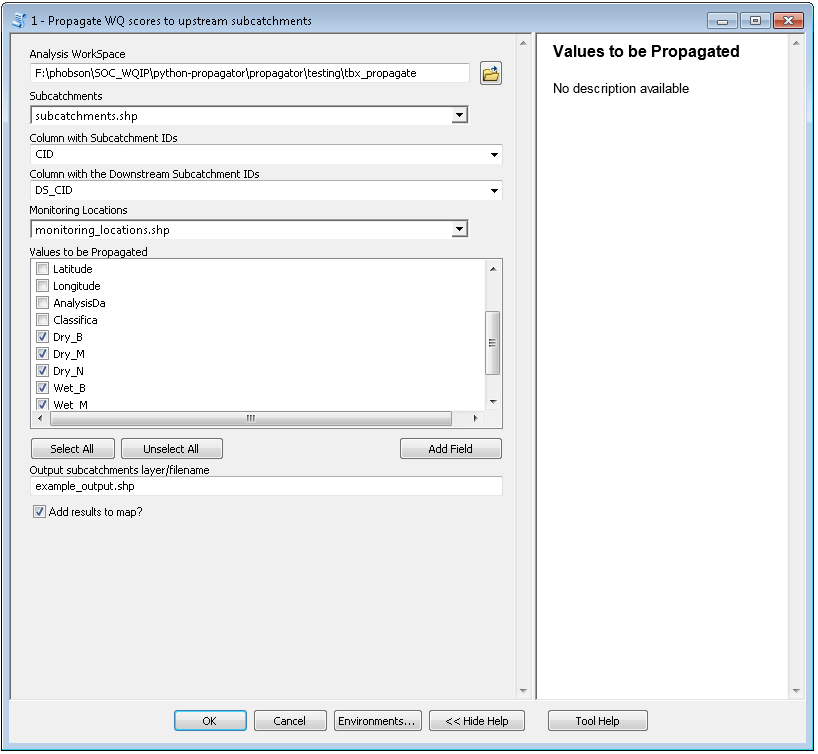

.. _arcgis:

Using **python-tidegates** as a python-toolbox in ArcGIS
========================================================

Finding the toolbox
--------------------
After you download or clone the source code (see :ref:`install instructions <install>`), you can navigate to the source directory in ArcCatalog:

   An ArcCatalog window after navigating to the source code of **python-tidegates**.

At this point you can double click either of the tools to use them.

   An empty form for the toolbox titled *1 - Create flood scenarios*.

.. figure:: images/accumulator_unfilled.png
   :scale: 100 %
   :alt: Finding the toolbox in ArcCatalog
   :align: center
   :figwidth: image

   An empty form for the toolbox titled *2 - Evaluate all standard scenarios*.

Inputs to the toolboxes
-----------------------

Both toolboxes take several identical parameters:
TBD

Common input parameters
~~~~~~~~~~~~~~~~~~~~~~~

The following are the parameters shared by both toolboxes.
All parameters are required except where noted.

Analysis Workspace (``workspace``)
    This is the folder or geodatabase that contains all of the input for the analysis.

    .. note:: All of the input for the analysis (see below) *must* be in this workspace.

TBD

    .. warning:: Both toolboxes will overwrite any previous output if duplicate filenames are provided.

Examples of filled out forms
----------------------------

TBD

   A completed form for the toolbox titled *1 - Propagate values to subcatchments*.
   Note that some, but not all, of the optional input parameters are specified.

.. figure:: images/accumulator_filled.png
   :scale: 100 %
   :alt: Finding the toolbox in ArcCatalog
   :align: center
   :figwidth: image

   An completed form for the toolbox titled *2 - Accumulate values from subcatchments*.
   Note that some, but not all, of the optional input parameters are specified.

If you encounter a ``MemoryError``
----------------------------------
By default, ArcGIS geoprocessing operations occur in the "foreground".
What this means is that the geoprocessing occurs within ArcMap or ArcCatalog, rather than in a separate computation process.
The major implication of this are is those geoprocessing operations are limited to ArcGIS's 32-bit version of python.
Any 32-bit process is only able to access roughly 3 gigabytes of RAM (this various with other hardware in the machine).

In constrast, 64-bit applications have a theoretical maximum RAM limit of server million terabytes.
In other words, about as much RAM as you have on a modern personal computer that happily runs ArcGIS.
Recognizing this, Esri also provides a 64-bit python that can operate in the "background" (i.e., a separate process from ArcGIS).

This can be enabled from the *Geoprocessing | Geoprocessing options* menu in ArcGIS.
Doing so *may* solve issues where the toolboxes fail due to an `MemoryError` (running out of RAM).
However, some datasets are Just-Too-Big for ArcGIS or your computer and will continue to raise errors.
In these cases, it's best to split up the datasets -- especially -- the rasters into multiple layers.

.. figure:: images/background_gp.png
   :scale: 100 %
   :alt: Enabling background processing
   :align: center
   :figwidth: image

   Enabling background (64-bit) geoprocessing in ArcMap.

Other ways of using **python-propagator**
-----------------------------------------
Since **python-propagator** is a python-based toolbox for ArcGIS, great care was taken to create the tool such that it could be called from python without opening ArcMap or ArcCatalog.
Using the tools from a python intepreter is described in :ref:`the next section <python>`.
